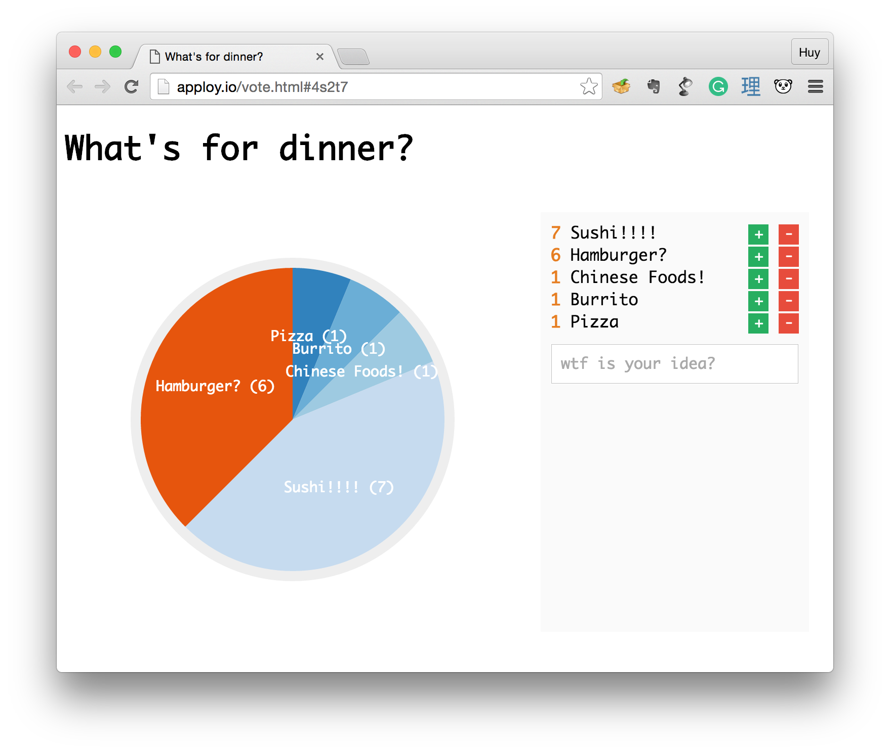

# Pure JS Vote System



## What is this?
Single HTML file vote system! Don't you see the screenshot?

## What?? What???
Okay... This is the simple vote system using JSON data (hosted on [myjson.com](http://myjson.com)), and the awesome pie chart for visuallization using [D3.js](http://d3js.org).

## No idea! `¯\_(ツ)_/¯`
Are you dump? OK. Here is the demo: [http://apploy.io/vote.html](http://apploy.io/vote.html)

## Wow! Is it realtime?
Nope! WTH are you thinking??? But it's automatically update (fetch the JSON data) every 2 seconds!!!

## Cool! How do I use it?
On your **local** machine, just run the `up` script:

```
./up
```

Then go to [http://localhost:8000](http://localhost:8000)

## How do I deploy it to my server?
Just upload `index.html` to any hosting you want.

## Uh ohh... All in one HTML file?
This was made in just 10 minutes...
